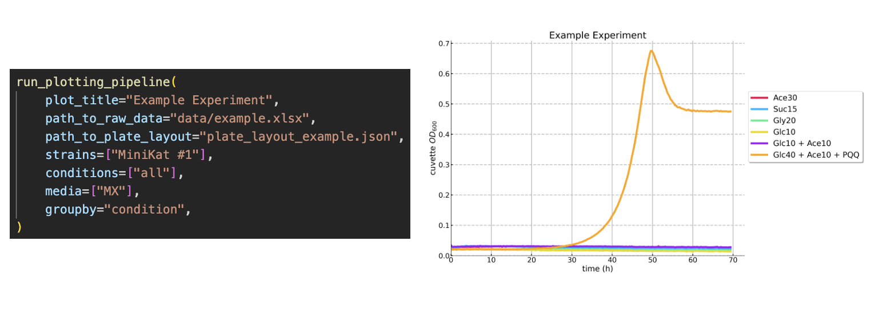

# growth-figures

Plot growth figures in a few lines of code:


## How to Use

0. Download this repository.
1. Make sure that Python is installed.
2. Open the folder of this repository in your terminal.
3. Run `pip install -r requirements.txt` to install all required packages.
4. Create a folder called `data` and put all raw data to be analysed into this folder
5. (Optional) For easiest use, create a json file describing your plate layout. It should be formatted as follows:

```json
[
  {
    "condition": <string>,
    "strain": <string>,
    "medium": <string>,
    "replicate": <string>,
    "well": <string>
  }
]
```

An example can be found at `plate_layout_example.json`.

6. Open the script `Plotting Script.ipynb` and click on "Run all"

### How to create a plate_layout.json

You have a couple of options:

- Manually
- Programmatically
  - Using the Create Plate Layout.ipynb notebook
  - Using your own script

Make sure your json is actually valid json (e.g. by copy pasting it into here: https://jsonlint.com/)

## Troubleshooting

I'm always happy to help - just shoot me an email (mail@timonschneider.de).

## Credits

Original Script Author: https://github.com/he-hai

## Comments Workshop

- integrate media variable into more general _conditions_ variable
- allow for more replicates
- If you make changes to any other files than the current notebook you have to restart kernel
- Line style changes must be more accessible
- data folder with subfolders explanation in README
- explain where and how to change colors
- [ ] Allow for flexible well properties
  - [ ] Extend groupby functionality accordingly
- Show how to plot specific number of hours/adjust x scale

# ToDo

- Measurement period is not used???
